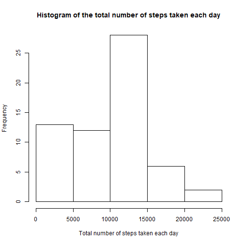
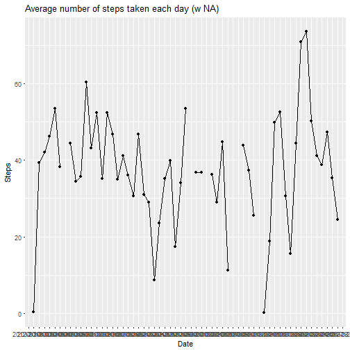
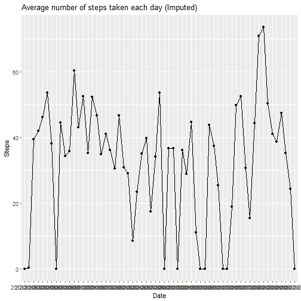
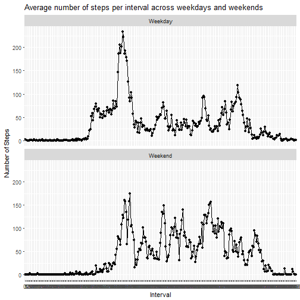

## Step 1: Code for reading in the dataset and/or processing the data


```r
## Load and preprocess the data 
acty_data1 <- read.csv2(unz("activity.zip", "activity.csv"), header=TRUE,sep=",")
acty_data1$steps <- as.numeric(acty_data1$steps) 
acty_data1$date <- as.Date(acty_data1$date) 
acty_data1 <- transform(acty_data1, date=factor(date), interval=factor(interval))
str(acty_data1)
```

'data.frame':	17568 obs. of  3 variables:
 $ steps   : num  NA NA NA NA NA NA NA NA NA NA ...
 $ date    : Factor w/ 61 levels "2012-10-01","2012-10-02",..: 1 1 1 1 1 1 1 1 1 1 ...
 $ interval: Factor w/ 288 levels "0","5","10","15",..: 1 2 3 4 5 6 7 8 9 10 ...

```r
head(acty_data1)
```

  steps       date interval
1    NA 2012-10-01        0
2    NA 2012-10-01        5
3    NA 2012-10-01       10
4    NA 2012-10-01       15
5    NA 2012-10-01       20
6    NA 2012-10-01       25

## Step 2: Histogram of the total number of steps taken each day


```r
## Summarize number of steps by date, excluding NA values
acty_data2 <- aggregate(x=acty_data1$steps, by=acty_data1[c("date")], FUN=sum, na.rm=TRUE)
str(acty_data2)
```

'data.frame':	61 obs. of  2 variables:
 $ date: Factor w/ 61 levels "2012-10-01","2012-10-02",..: 1 2 3 4 5 6 7 8 9 10 ...
 $ x   : num  0 126 11352 12116 13294 ...

```r
head(acty_data2)
```

        date     x
1 2012-10-01     0
2 2012-10-02   126
3 2012-10-03 11352
4 2012-10-04 12116
5 2012-10-05 13294
6 2012-10-06 15420

```r
## Histogram of the total number of steps taken each day
hist(acty_data2[,2], xlab="Total number of steps taken each day", main="Histogram of the total number of steps taken each day")
```



## Step 3: Mean and median number of steps taken each day


```r
## Calculate mean and median number of steps taken each day
library(doBy)
acty_data3 <- summaryBy(steps ~ date, data = acty_data1, FUN = list(mean, median), na.rm=TRUE)
str(acty_data3)
```

'data.frame':	61 obs. of  3 variables:
 $ date        : Factor w/ 61 levels "2012-10-01","2012-10-02",..: 1 2 3 4 5 6 7 8 9 10 ...
 $ steps.mean  : num  NaN 0.438 39.417 42.069 46.16 ...
 $ steps.median: num  NA 0 0 0 0 0 0 NA 0 0 ...

```r
head(acty_data3)
```

        date steps.mean steps.median
1 2012-10-01        NaN           NA
2 2012-10-02    0.43750            0
3 2012-10-03   39.41667            0
4 2012-10-04   42.06944            0
5 2012-10-05   46.15972            0
6 2012-10-06   53.54167            0

## Step 4: Time series plot of the average number of steps taken


```r
## Plot of the average number of steps taken by date, including NA
acty_data3 <- transform(acty_data3, date=factor(date))
library(ggplot2)
ggplot(acty_data3, aes(date, steps.mean, group = 1)) + geom_point() + geom_line() +
  labs(x = "Date", y = "Steps", title = "Average number of steps taken each day (w NA)")
```

```
## Warning: Removed 8 rows containing missing values (geom_point).
```

```
## Warning: Removed 2 rows containing missing values (geom_path).
```



## Step 5: The 5-minute interval that, on average, contains the maximum number of steps


```r
## Exclude NA rows
acty_data4 <- acty_data1[complete.cases(acty_data1),]
## Create numeric column for number of steps
max_step <- max(acty_data4$steps, na.rm=TRUE)
## Search for row with max steps
acty_data4[acty_data4$steps == max_step, ]
```

      steps       date interval
16492   806 2012-11-27      615

```r
## Here is an alternative approach using arrange function; might be more efficient
library(dplyr)
head(arrange(acty_data1, desc(steps)),1)
```

  steps       date interval
1   806 2012-11-27      615

## Step 6: Code to describe and show a strategy for imputing missing data


```r
## Calculate and report the total number of missing values in the dataset 
sum(is.na(acty_data1$steps))
```

[1] 2304

```r
## Imputing missing values.  For all the steps value as NA, set to 0
## This is no ideal solution
acty_data1$stepsImputed <- acty_data1$steps
acty_data1[is.na(acty_data1$steps),4] <- 0
str(acty_data1)
```

'data.frame':	17568 obs. of  4 variables:
 $ steps       : num  NA NA NA NA NA NA NA NA NA NA ...
 $ date        : Factor w/ 61 levels "2012-10-01","2012-10-02",..: 1 1 1 1 1 1 1 1 1 1 ...
 $ interval    : Factor w/ 288 levels "0","5","10","15",..: 1 2 3 4 5 6 7 8 9 10 ...
 $ stepsImputed: num  0 0 0 0 0 0 0 0 0 0 ...

```r
head(acty_data1)
```

  steps       date interval stepsImputed
1    NA 2012-10-01        0            0
2    NA 2012-10-01        5            0
3    NA 2012-10-01       10            0
4    NA 2012-10-01       15            0
5    NA 2012-10-01       20            0
6    NA 2012-10-01       25            0

```r
sum(is.na(acty_data1$stepsImputed))
```

[1] 0

## Step 7: Histogram of the total number of steps taken each day after missing values are imputed


```r
## Plot of the average number of steps taken by date, excluding NA
acty_data3A <- summaryBy(stepsImputed ~ date, data = acty_data1, FUN = list(mean, median), na.rm=TRUE)
acty_data3A <- transform(acty_data3A, date=factor(date))
ggplot(acty_data3A, aes(date, stepsImputed.mean, group = 1)) + geom_point() + geom_line() + 
  labs(x = "Date", y = "Steps", title = "Average number of steps taken each day (Imputed)")
```



## Step 8: Panel plot comparing the average number of steps taken per 5-minute interval across weekdays and weekends


```r
## Calculate weekday_type column based on date
acty_data1$weekday <- weekdays(as.Date(acty_data1$date))
acty_data1$weekday_type <- sapply(acty_data1$weekday, switch,
                                  Monday ='Weekday', Tuesday ='Weekday', Wednesday ='Weekday', 
                                  Thursday ='Weekday', Friday = 'Weekday', Saturday = 'Weekend', 
                                  Sunday = 'Weekend')
acty_data1 <- transform(acty_data1, weekday_type=factor(weekday_type), interval=factor(interval))
## Summarize average number of steps by weekday_type and interval, excluding NA values
acty_data5 <- aggregate(x=acty_data1[1], by=acty_data1[c("weekday_type","interval")], FUN=mean, na.rm=TRUE)
str(acty_data5)
```

'data.frame':	576 obs. of  3 variables:
 $ weekday_type: Factor w/ 2 levels "Weekday","Weekend": 1 2 1 2 1 2 1 2 1 2 ...
 $ interval    : Factor w/ 288 levels "0","5","10","15",..: 1 1 2 2 3 3 4 4 5 5 ...
 $ steps       : num  2.333 0 0.462 0 0.179 ...

```r
head(acty_data5)
```

  weekday_type interval     steps
1      Weekday        0 2.3333333
2      Weekend        0 0.0000000
3      Weekday        5 0.4615385
4      Weekend        5 0.0000000
5      Weekday       10 0.1794872
6      Weekend       10 0.0000000

```r
library(ggplot2)
ggplot(acty_data5, aes(interval, steps, group = 1)) +
  geom_point() + geom_line() + facet_wrap(~weekday_type, ncol=1) +
  labs(x = "Interval", y = "Number of Steps", 
       title = "Average number of steps per interval across weekdays and weekends")
```


